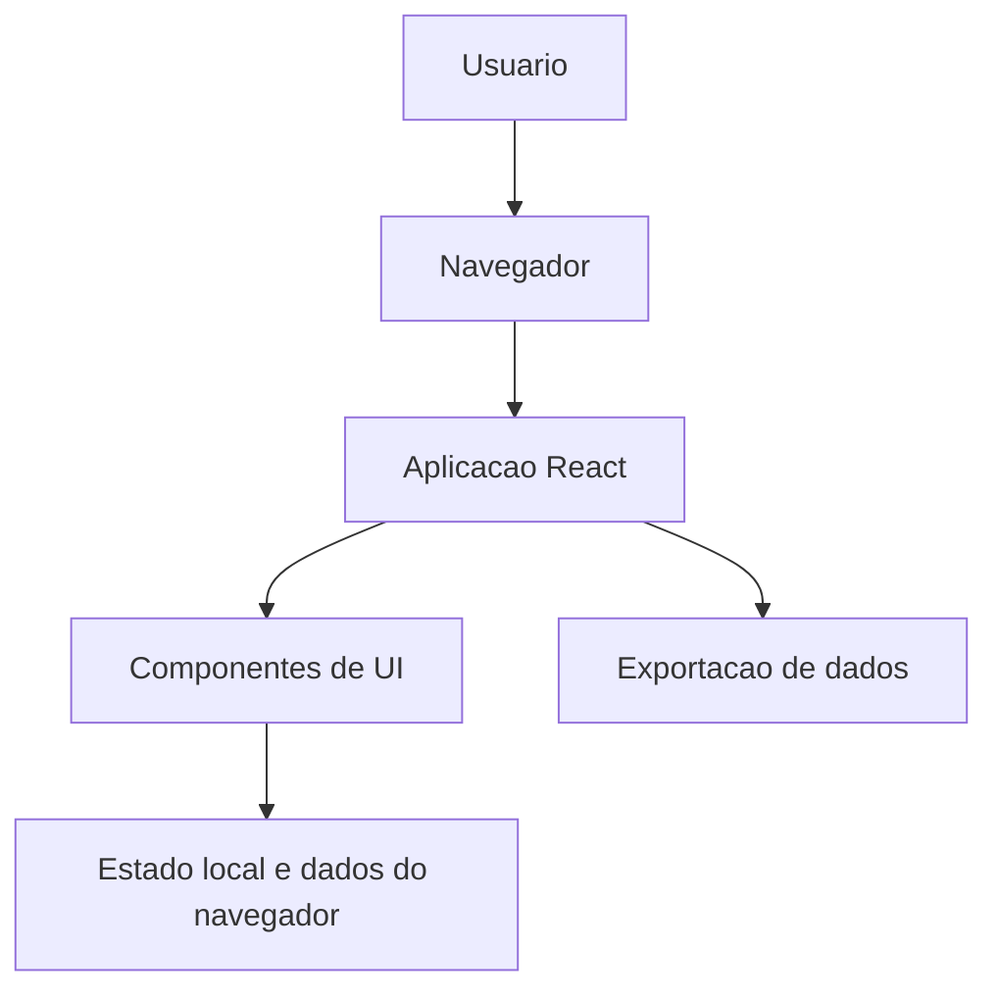
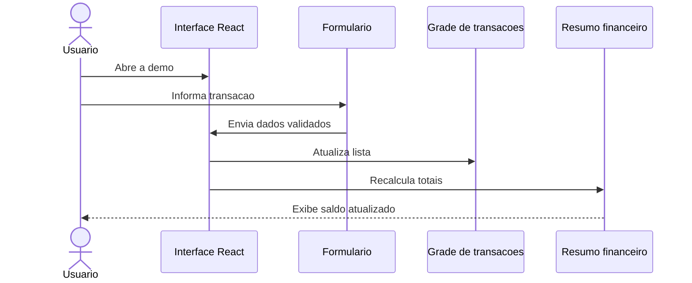
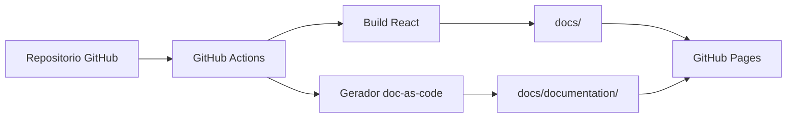

# Arc42

Este documento usa o template Arc42 para registrar a arquitetura do sistema de controle financeiro em uma estrutura padronizada.

## 1. Introducao e objetivos

O sistema apoia o controle financeiro pessoal por meio de uma interface web simples para registro, listagem e acompanhamento de receitas, despesas e saldo.

Objetivos principais:

- Permitir registro rapido de transacoes financeiras.
- Apresentar resumo financeiro de forma clara.
- Manter uma demo navegavel publicada no GitHub Pages.
- Evoluir documentacao tecnica como codigo, junto com o repositorio.

## 2. Restricoes

- A aplicacao atual e um frontend React publicado como site estatico.
- A publicacao usa GitHub Pages.
- A documentacao deve permanecer versionada em Markdown.
- Segredos e configuracoes sensiveis nao devem ser versionados.

## 3. Contexto e escopo

O sistema e usado por uma pessoa que deseja registrar transacoes e acompanhar seu saldo. No escopo atual, a aplicacao roda no navegador e nao depende de backend obrigatorio para a demo publicada.

## 4. Estrategia de solucao

A solucao separa a experiencia principal em componentes React e a documentacao em arquivos Markdown organizados por Diataxis.

- Demo: publicada na raiz de `docs/`.
- Documentacao: publicada em `docs/documentation/`.
- Fonte da documentacao: arquivos Markdown em `docs/tutorials`, `docs/how-to`, `docs/reference` e `docs/explanation`.

## 5. Visao de blocos

## 6. Visao de runtime

## 7. Visao de implantacao

## 8. Conceitos transversais

- Documentacao como codigo.
- Componentizacao da interface.
- Publicacao estatica.
- Organizacao Diataxis para separar tipos de conhecimento.

## 9. Decisoes arquiteturais

As decisoes relevantes ficam registradas em ADRs dentro da documentacao.

## 10. Qualidade

| Atributo | Abordagem |
| --- | --- |
| Manutenibilidade | Componentes React e documentacao versionada. |
| Portabilidade | Site estatico publicavel em GitHub Pages. |
| Rastreabilidade | Historico Git para codigo e documentacao. |
| Usabilidade | Interface direta para registro e consulta financeira. |

## 11. Riscos

- Divergencia entre a demo publicada e o codigo-fonte.
- Documentacao gerada ficar desatualizada se a pipeline falhar.
- Crescimento de regras financeiras sem testes automatizados suficientes.

## 12. Glossario

| Termo | Definicao |
| --- | --- |
| Demo | Versao estatica publicada para visualizacao da ferramenta. |
| Diataxis | Framework para organizar documentacao em tutorials, how-to, reference e explanation. |
| ADR | Registro de decisao arquitetural. |
| Arc42 | Template para documentar arquitetura de software. |
