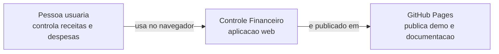
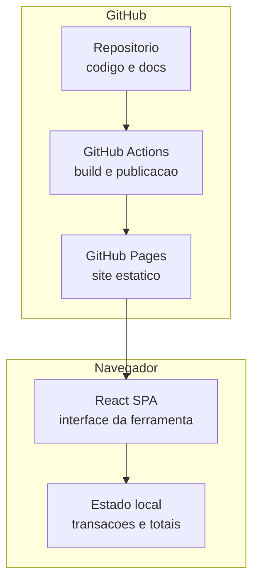
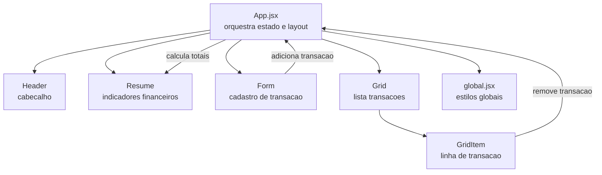

# Diagramas C4 componentes

Esta pagina apresenta visoes C4 em Mermaid para explicar o contexto, containers e componentes principais da aplicacao.

## Nivel 1: contexto

## Nivel 2: containers

## Nivel 3: componentes

## Notas de leitura

- O nivel de contexto mostra o sistema como uma caixa unica.
- O nivel de containers separa navegador, repositorio, pipeline e Pages.
- O nivel de componentes detalha a composicao React atual.
